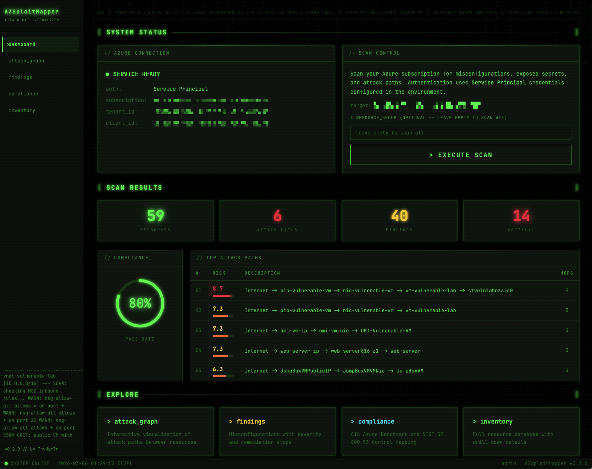

# AZSploitMapper



Azure Attack Path Visualizer and Cloud Security Posture Management (CSPM) tool.
Discover resources, detect misconfigurations, visualize attack paths, and assess compliance
against CIS Azure Benchmark and NIST SP 800-53 -- all through a terminal-themed web console.

## Features

- **Resource Discovery** -- scans Azure subscriptions via the Azure SDK (VMs, NSGs, Public IPs, Storage, Key Vault, Managed Identities, RBAC)
- **Misconfiguration Detection** -- YAML-based rule engine with 17+ built-in rules covering networking, storage, compute, identity, and key vault
- **Secret Scanning** -- regex-based detection of exposed credentials (API keys, connection strings, JWTs, private keys)
- **Attack Graph Visualization** -- interactive Cytoscape.js graph with color-coded nodes, path highlighting, and risk scoring
- **Compliance Assessment** -- full CIS Azure Benchmark v2.1.0 (44 controls) and NIST SP 800-53 (28 controls) with pass/fail per control, category grouping, and compliance score gauges
- **Resource Inventory** -- grouped resource tree with drill-down details, properties viewer, and per-resource findings
## Table of Contents

- [Prerequisites](#prerequisites)
- [Option A: Local Development (without Docker)](#option-a-local-development-without-docker)
- [Option B: Docker Deployment (Recommended)](#option-b-docker-deployment-recommended)
- [Option C: Production Deployment on Azure](#option-c-production-deployment-on-azure)
- [Authentication Guide](#authentication-guide)
- [CLI Reference](#cli-reference)
- [Architecture](#architecture)
- [Tech Stack](#tech-stack)
- [Troubleshooting](#troubleshooting)

---

## Prerequisites

Before you begin, make sure you have the following installed on your machine:

| Tool | Version | What it is used for | How to install |
|------|---------|-------------------|----------------|
| Python | 3.11 or higher | Running the application | [python.org/downloads](https://www.python.org/downloads/) |
| Docker | 20.10 or higher | Containerized deployment | [docs.docker.com/get-docker](https://docs.docker.com/get-docker/) |
| Azure CLI | 2.50 or higher | Creating Service Principals | [learn.microsoft.com/cli/azure/install-azure-cli](https://learn.microsoft.com/en-us/cli/azure/install-azure-cli) |
| OpenSSL | any version | Generating TLS certificates | Pre-installed on macOS and Linux |

You also need an Azure subscription that you want to scan. The free tier works fine.

### Test Environment (Vulnerable Lab)

If you do not have an Azure environment with resources to scan, or you want a safe
target with known misconfigurations, use the included
[**Vulnerable Lab**](vulnerable_lab/). It deploys intentionally insecure Azure
resources (open NSG, public storage, VM with managed identity) that create a realistic
attack path for AZSploitMapper to detect. See the
[vulnerable_lab/README.md](vulnerable_lab/README.md) for setup instructions.

---

## Option A: Local Development (without Docker)

Use this option if you want to run AZSploitMapper directly on your machine without Docker.
This is the simplest way to get started for development and testing.

### Step 1: Clone and enter the project directory

```bash
cd AZSploitMapper
```

### Step 2: Create a Python virtual environment

A virtual environment keeps the project dependencies isolated from your system Python.

```bash
# Create a new virtual environment in a folder called "venv"
python3 -m venv venv

# Activate the virtual environment
# On macOS / Linux:
source venv/bin/activate

# On Windows (PowerShell):
.\venv\Scripts\Activate.ps1
```

After activation, your terminal prompt will show `(venv)` at the beginning.
This means all `pip install` commands will install packages inside this folder only.

### Step 3: Install all Python dependencies

```bash
pip install -r requirements.txt
```

This installs FastAPI, Azure SDK, NetworkX, and all other libraries the app needs.
It may take 1-2 minutes depending on your internet speed.

### Step 4: Create an Azure Service Principal

A Service Principal is like a dedicated user account for your application.
It authenticates to Azure using a client ID and secret instead of your personal login.

```bash
# First, log in to Azure with your personal account
az login

# Create a Service Principal with Reader permissions on your subscription
# Replace YOUR_SUBSCRIPTION_ID with your actual Azure subscription ID
az ad sp create-for-rbac \
  --name "AZSploitMapper" \
  --role Reader \
  --scopes /subscriptions/YOUR_SUBSCRIPTION_ID
```

This command will output something like:

```json
{
  "appId": "xxxxxxxx-xxxx-xxxx-xxxx-xxxxxxxxxxxx",
  "displayName": "AZSploitMapper",
  "password": "xxxxxxxxxxxxxxxxxxxxxxxxxxxxxxxxxx",
  "tenant": "xxxxxxxx-xxxx-xxxx-xxxx-xxxxxxxxxxxx"
}
```

**Save these values** -- you will need them in the next step:
- `appId` is your `AZURE_CLIENT_ID`
- `password` is your `AZURE_CLIENT_SECRET`
- `tenant` is your `AZURE_TENANT_ID`

### Step 5: Configure environment variables

```bash
# Copy the example environment file
cp .env.example .env
```

Now open `.env` in a text editor and fill in the values from Step 4:

```bash
# These four values are REQUIRED for scanning
AZURE_CLIENT_ID=paste-the-appId-here
AZURE_CLIENT_SECRET=paste-the-password-here
AZURE_TENANT_ID=paste-the-tenant-here
AZURE_SUBSCRIPTION_ID=paste-your-subscription-id-here
```

**IMPORTANT:** Never commit the `.env` file to Git. It contains secrets.
The `.gitignore` file already excludes it.

### Step 6: Generate an API key for dashboard access

The web dashboard requires an API key to prevent unauthorized access.

```bash
python -m azsploitmapper generate-api-key --name "admin"
```

This will output something like:

```
API Key Generated Successfully

  Name:       admin
  Prefix:     azm_abc12345
  Expires:    2026-06-05T12:00:00+00:00

IMPORTANT: Copy this key NOW. It will NOT be shown again.

  azm_xxxxxxxxxxxxxxxxxxxxxxxxxxxxxxxxxxxxxxxx
```

Copy the full key and add it to your `.env` file:

```bash
AZSPLOITMAPPER_API_KEY=azm_xxxxxxxxxxxxxxxxxxxxxxxxxxxxxxxxxxxxxxxx
```

### Step 7: Generate TLS certificates

HTTPS requires a certificate and a private key. For local development,
you can create a self-signed certificate:

```bash
# Create the certs directory
mkdir -p certs

# Generate a self-signed certificate valid for 365 days
openssl req -x509 -newkey rsa:4096 \
  -keyout certs/key.pem \
  -out certs/cert.pem \
  -days 365 \
  -nodes \
  -subj '/CN=localhost'
```

What this does:
- `-x509` -- creates a self-signed certificate (not a certificate request)
- `-newkey rsa:4096` -- generates a new 4096-bit RSA private key
- `-keyout certs/key.pem` -- saves the private key to this file
- `-out certs/cert.pem` -- saves the certificate to this file
- `-days 365` -- the certificate is valid for one year
- `-nodes` -- do not encrypt the private key with a passphrase
- `-subj '/CN=localhost'` -- sets the Common Name to "localhost"

### Step 8: Load environment variables and start the dashboard

```bash
# Load all variables from the .env file into your shell session
export $(grep -v '^#' .env | xargs)

# Start the web dashboard
python -m azsploitmapper serve
```

You will see output like:

```
AZSploitMapper dashboard
  Listening on https://0.0.0.0:8443
  TLS enabled (cert: certs/cert.pem)
  Use POST /api/scan to trigger a scan.
```

### Step 9: Open the dashboard

Open your browser and go to:

```
https://localhost:8443
```

Your browser will show a security warning because the certificate is self-signed.
This is expected and safe for local development:
- **Chrome**: Click "Advanced" then "Proceed to localhost (unsafe)"
- **Firefox**: Click "Advanced" then "Accept the Risk and Continue"
- **Safari**: Click "Show Details" then "visit this website"

The dashboard loads immediately -- no login form, no password to enter.
Because you configured the API key in `.env` (Step 6), the server knows
you are the operator and automatically creates a session for you.

Your configured Azure subscription ID is displayed on the dashboard.
Click **EXECUTE SCAN** to start scanning.

### Step 10: Run a scan via CLI (alternative to the web dashboard)

You can also run scans from the command line without the web dashboard:

```bash
# Run a scan and print results to terminal only (no web server)
python -m azsploitmapper scan \
  --subscription-id YOUR_SUBSCRIPTION_ID \
  --cli-only
```

Or run a scan and then start the web dashboard to view results:

```bash
# Run a scan and start the dashboard with results loaded
python -m azsploitmapper scan \
  --subscription-id YOUR_SUBSCRIPTION_ID
```

### Step 11: Deactivate the virtual environment when done

When you are finished working with AZSploitMapper:

```bash
deactivate
```

This returns your terminal to using the system Python.

---

## Option B: Docker Deployment (Recommended)

Docker is the recommended way to run AZSploitMapper. It packages everything
(Python, dependencies, app code) into a single container that runs the same
way on any machine. The container runs as a non-root user with minimal
privileges for security.

### Step 1: Install Docker

If you do not have Docker installed yet:

- **macOS**: Download [Docker Desktop for Mac](https://docs.docker.com/desktop/install/mac-install/)
- **Windows**: Download [Docker Desktop for Windows](https://docs.docker.com/desktop/install/windows-install/)
- **Linux**: Follow the [Docker Engine install guide](https://docs.docker.com/engine/install/)

Verify Docker is working:

```bash
docker --version
# Expected output: Docker version 24.x.x or higher

docker compose version
# Expected output: Docker Compose version v2.x.x or higher
```

### Step 2: Create an Azure Service Principal

If you have not done this yet, create a Service Principal (see [Step 4 in Option A](#step-4-create-an-azure-service-principal) for detailed instructions):

```bash
az login

az ad sp create-for-rbac \
  --name "AZSploitMapper" \
  --role Reader \
  --scopes /subscriptions/YOUR_SUBSCRIPTION_ID
```

Save the `appId`, `password`, and `tenant` from the output.

### Step 3: Configure environment variables

```bash
# Copy the example file
cp .env.example .env
```

Open `.env` and fill in your Service Principal credentials:

```bash
AZURE_CLIENT_ID=paste-the-appId-here
AZURE_CLIENT_SECRET=paste-the-password-here
AZURE_TENANT_ID=paste-the-tenant-here
AZURE_SUBSCRIPTION_ID=paste-your-subscription-id-here
```

### Step 4: Generate TLS certificates

```bash
mkdir -p certs

openssl req -x509 -newkey rsa:4096 \
  -keyout certs/key.pem \
  -out certs/cert.pem \
  -days 365 \
  -nodes \
  -subj '/CN=localhost'
```

### Step 5: Build the Docker image

```bash
docker compose build
```

This builds the application image using the multi-stage Dockerfile.
The first build takes 2-3 minutes (downloading Python packages).
Subsequent builds are faster because Docker caches the layers.

### Step 6: Generate an API key

Run the key generation command inside a temporary container:

```bash
docker compose run --rm azsploitmapper \
  python -m azsploitmapper generate-api-key --name "admin"
```

Copy the generated key and add it to your `.env` file:

```bash
AZSPLOITMAPPER_API_KEY=azm_xxxxxxxxxxxxxxxxxxxxxxxxxxxxxxxxxxxxxxxx
```

### Step 7: Start the application

```bash
# Start in the background (-d = detached mode)
docker compose up -d
```

Check that the container is running:

```bash
docker compose ps
```

You should see:

```
NAME                  STATUS    PORTS
azsploitmapper-...    Up        0.0.0.0:8443->8443/tcp
```

### Step 8: Open the dashboard and log in

Open your browser and go to:

```
https://localhost:8443
```

Accept the self-signed certificate warning (same as in Option A, Step 9).
The dashboard loads immediately -- no login form needed (same as Option A).

### Step 9: Test the API with curl (optional)

You can also interact with the API directly using curl:

```bash
# Health check (no auth required)
curl -k https://localhost:8443/api/health

# Trigger a scan (requires API key in header)
curl -k -X POST \
  -H "Authorization: Api-Key YOUR_API_KEY" \
  -H "Content-Type: application/json" \
  -d '{"subscription_id": "YOUR_SUBSCRIPTION_ID"}' \
  https://localhost:8443/api/scan
```

### Step 10: View logs

```bash
# View live container logs
docker compose logs -f

# Or check the log files on disk
cat logs/azsploitmapper.log
```

### Step 11: Stop the application

```bash
# Stop and remove the container
docker compose down
```

Your data (scan results, API keys) is preserved in the `data/` directory
because it is mounted as a Docker volume.

### Step 12: Update the application

When there is a new version of AZSploitMapper:

```bash
# Stop the running container
docker compose down

# Rebuild with the latest code
docker compose build

# Start again
docker compose up -d
```

---

## Option C: Production Deployment on Azure

For production use, deploy AZSploitMapper to Azure Container Instances (ACI)
using Terraform. This creates a fully isolated, VNet-protected deployment
with Entra ID authentication and a Managed Identity for scanning.

### Step 1: Install Terraform

Download Terraform from [terraform.io/downloads](https://developer.hashicorp.com/terraform/downloads)
or install via package manager:

```bash
# macOS (using Homebrew)
brew install terraform

# Verify installation
terraform --version
```

### Step 2: Create a Service Principal for Terraform

Terraform needs its own Service Principal to create Azure resources.
This is separate from the scanner's Service Principal.

```bash
az login

# Create a Service Principal with Contributor role
az ad sp create-for-rbac \
  --name "Terraform-AZSploitMapper" \
  --role Contributor \
  --scopes /subscriptions/YOUR_SUBSCRIPTION_ID
```

Set the Terraform authentication environment variables:

```bash
export ARM_CLIENT_ID="paste-appId"
export ARM_CLIENT_SECRET="paste-password"
export ARM_SUBSCRIPTION_ID="YOUR_SUBSCRIPTION_ID"
export ARM_TENANT_ID="paste-tenant"
```

### Step 3: Generate an API key for production

Before deploying, generate an API key that will be injected into the container:

```bash
# You can run this locally (with the venv activated)
python -m azsploitmapper generate-api-key --name "production" --expires-days 90
```

Save the generated key securely. You will need it in Step 5.

### Step 4: Configure Terraform variables

Create a file called `terraform/terraform.tfvars`:

```hcl
subscription_id   = "YOUR_SUBSCRIPTION_ID"
dns_label         = "your-unique-name"
allowed_source_ip = "YOUR_PUBLIC_IP/32"
api_key           = "azm_your-generated-api-key"
```

**About `allowed_source_ip`:** This restricts who can access the dashboard.
Set it to your office or home IP address. You can find your public IP at
[whatismyip.com](https://www.whatismyip.com/). Use CIDR notation (e.g. `203.0.113.50/32`
for a single IP, or `203.0.113.0/24` for a range).

**IMPORTANT:** Never set `allowed_source_ip` to `*` in production.
That would allow anyone on the internet to access your security scanner.

### Step 5: Initialize and deploy

```bash
cd terraform

# Download the Azure provider plugins
terraform init

# Preview what Terraform will create (no changes made yet)
terraform plan

# Apply the configuration (creates all resources)
terraform apply
```

Terraform will show you exactly what it will create and ask for confirmation.
Type `yes` to proceed.

What gets created:
- **Resource Group** -- container for all resources
- **Virtual Network + Subnet** -- isolated private network
- **Network Security Group** -- firewall rules (HTTPS from your IP only)
- **Entra ID App Registration** -- for OAuth2 browser authentication
- **User-Assigned Managed Identity** -- for Azure scanning (Reader role only)
- **Container Instance** -- runs the AZSploitMapper Docker image

### Step 6: Set up a remote Terraform backend (recommended)

By default, Terraform stores state locally. For production, use an encrypted
remote backend so the state (which contains secrets) is not on your laptop:

```bash
# Create a storage account for Terraform state
az storage account create \
  --name stterraformstate$(openssl rand -hex 4) \
  --resource-group rg-terraform-state \
  --sku Standard_LRS \
  --encryption-services blob

# Create a container for the state file
az storage container create \
  --name tfstate \
  --account-name YOUR_STORAGE_ACCOUNT_NAME
```

Then uncomment the `backend "azurerm"` block in `terraform/main.tf` and
fill in your storage account details.

### Step 7: Access the dashboard

After Terraform finishes, check the outputs:

```bash
terraform output
```

The dashboard is accessible from your whitelisted IP via HTTPS.

### Step 8: Destroy the deployment (when no longer needed)

```bash
cd terraform
terraform destroy
```

This removes all Azure resources created by Terraform.
Type `yes` to confirm.

---

## Authentication Guide

AZSploitMapper has two authentication modes. Which one you use depends on
how many people need access to the dashboard.

### Mode 1: API Key (single user -- local and Docker)

This is the default mode. It works out of the box when you follow the setup
steps in Option A or B. There is **no login screen** -- you open the browser
and the dashboard loads immediately.

**How it works behind the scenes:**

- You generate an API key and put it in `.env` (`AZSPLOITMAPPER_API_KEY=azm_...`)
- The server sees the key is configured and knows there is exactly one operator
- When you open the browser, the server automatically creates a session for you
- No username, no password, no login form -- you are the admin
- The API key still protects the REST API from unauthorized programmatic access
  (scripts, curl, CI/CD pipelines must send the key in the `Authorization` header)

**When to use this mode:**

- You are the only person using the dashboard (local development, personal lab)
- You deployed the app in Docker for yourself or a small team sharing one machine
- You want the simplest possible setup with no Azure AD configuration

**Managing keys via CLI:**

```bash
# Generate a new API key
python -m azsploitmapper generate-api-key --name "admin"

# List all API keys
python -m azsploitmapper list-api-keys

# Revoke a compromised key (use the prefix shown in list-api-keys)
python -m azsploitmapper revoke-api-key --prefix "azm_abc12345"
```

**Using the API key in scripts or CI/CD (without a browser):**

```bash
# Add the Api-Key header to every request
curl -k -H "Authorization: Api-Key YOUR_KEY" https://localhost:8443/api/scans
```

### Mode 2: Entra ID / Azure AD (multiple users -- production)

Use this mode when **more than one person** needs to access the dashboard,
for example in a team or an organization. Instead of sharing one API key
(which is insecure), each user logs in with their own Microsoft account.

**How it works:**

1. You register an application in Azure AD (called "App Registration" or "Entra ID application")
2. This tells Azure: "AZSploitMapper is allowed to ask users from my tenant to log in"
3. When someone opens the dashboard in a browser, they see a login page with a
   "SIGN IN WITH MICROSOFT" button
4. Clicking it redirects to Microsoft's login page (login.microsoftonline.com)
5. The user signs in with their corporate Microsoft account (e.g. john@yourcompany.com)
6. Microsoft sends the user back to AZSploitMapper with a token proving their identity
7. AZSploitMapper creates a session and the user sees the dashboard

**Who can log in?**

Only users from **your Azure AD tenant** (your organization). Random people
on the internet cannot log in even if they know the URL, because Microsoft
will reject any account that does not belong to your tenant. This is the same
mechanism that protects Azure Portal, Teams, Outlook, and all other Microsoft 365 apps.

**When to use this mode:**

- Multiple security analysts in your team need dashboard access
- You deploy the app on Azure (Option C) and want proper identity management
- You want an audit trail of which user triggered which scan
- Company policy requires Microsoft SSO for all internal tools

**How to set it up:**

If you use **Option C (Terraform)**, the App Registration is created automatically.
You do not need to do anything extra.

If you want to set it up **manually** (for Option A or B), follow these steps:

1. Go to [Azure Portal](https://portal.azure.com) > **Microsoft Entra ID** > **App registrations** > **New registration**
2. Name: `AZSploitMapper`, Redirect URI: `https://localhost:8443/auth/callback` (type: Web)
3. After creation, go to **Certificates & secrets** > **New client secret** and copy the secret value
4. Add these four variables to your `.env` file:

```bash
# Entra ID / Azure AD configuration (for multi-user login)
ENTRA_CLIENT_ID=paste-the-Application-Client-ID-from-Overview-page
ENTRA_CLIENT_SECRET=paste-the-secret-value-you-just-created
ENTRA_TENANT_ID=paste-your-Azure-AD-Tenant-ID-from-Overview-page
AUTH_REDIRECT_URI=https://localhost:8443/auth/callback
```

5. Restart the server. Now the login page will show both options:
   an API key input field AND a "SIGN IN WITH MICROSOFT" button.

**Summary: which mode to choose?**

| Scenario | Mode | What you configure |
|----------|------|--------------------|
| Just you, locally | API Key | `AZSPLOITMAPPER_API_KEY` in `.env` |
| Just you, Docker | API Key | `AZSPLOITMAPPER_API_KEY` in `.env` |
| Team, on Azure | Entra ID | Terraform creates it automatically |
| Team, self-hosted | Entra ID | Manual App Registration + `.env` variables |

---

## CLI Reference

All commands are run with `python -m azsploitmapper`:

```bash
# Start the web dashboard (HTTPS on port 8443)
python -m azsploitmapper serve
python -m azsploitmapper serve --port 9443

# Run a scan and show results in the terminal
python -m azsploitmapper scan --subscription-id SUB_ID --cli-only

# Run a scan and start the dashboard with results loaded
python -m azsploitmapper scan --subscription-id SUB_ID

# Scan only a specific resource group
python -m azsploitmapper scan --subscription-id SUB_ID --resource-group rg-my-lab

# Generate an API key (key shown only once -- save it immediately)
python -m azsploitmapper generate-api-key --name "admin"
python -m azsploitmapper generate-api-key --name "ci-pipeline" --expires-days 30

# List all API keys with their status
python -m azsploitmapper list-api-keys

# Revoke an API key by its prefix
python -m azsploitmapper revoke-api-key --prefix "azm_abc12345"

# Show version
python -m azsploitmapper --version
```

---

## Architecture

```
AZSploitMapper/
  azsploitmapper/
    scanner/              # Azure SDK collectors + YAML rule engine + secret scanner
      auth.py             # Service Principal / Managed Identity authentication
      orchestrator.py     # Coordinates scan lifecycle
      collectors/         # Compute, Network, Storage, Identity, KeyVault collectors
      rules/              # Rule engine + models
    graph/                # NetworkX graph builder, BFS attack path finder, risk scorer
    compliance/           # CIS Azure Benchmark + NIST SP 800-53 control mapping
    auth/                 # Authentication middleware
      entra.py            # API Key + Entra ID OAuth2 + session management
      api_keys.py         # API key generation, validation, revocation
    api/                  # FastAPI app factory + REST API routes
      app.py              # Security headers, CORS, CSP, scan store
      routes/             # Scans, resources, paths, findings, compliance
    web/                  # Jinja2 templates (terminal theme) + static assets
    db/                   # SQLAlchemy models + SQLite persistence
    cli.py                # Click CLI (scan, serve, key management)
    logging_config.py     # Centralized audit logging
  config/
    default.yaml          # Main configuration (non-sensitive settings only)
    rules/                # YAML rule definitions (networking, compute, identity, keyvault)
  terraform/              # IaC for Azure deployment (VNet + ACI + Entra ID + RBAC)
  certs/                  # TLS certificates (not committed to Git)
  tests/                  # Unit tests for graph and rule engine
  .env.example            # Template for environment variables
  Dockerfile              # Multi-stage, non-root container image
  docker-compose.yml      # Hardened Docker deployment
```

## Tech Stack

| Layer | Technology |
|-------|-----------|
| Backend | Python 3.11+, FastAPI, Azure SDK |
| Graph Engine | NetworkX |
| Frontend | Jinja2, Cytoscape.js (self-hosted), vanilla JS |
| Auth | API Keys + MSAL Python (Entra ID OAuth2) |
| Azure Auth | Service Principal (ClientSecretCredential) |
| Database | SQLite + SQLAlchemy |
| Security | TLS, CSP headers, HSTS, rate limiting, audit logging |
| Deployment | Docker (non-root, read-only FS), Terraform, Azure Container Instances |
| Compliance | CIS Azure Benchmark v2.1.0, NIST SP 800-53 Rev. 5 |

## Security Features

| Feature | Description |
|---------|-------------|
| API Key Auth | Prowler-style keys with prefix, expiration, and revocation |
| Service Principal | Dedicated Azure identity with Reader-only RBAC |
| TLS/HTTPS | All traffic encrypted, HSTS headers enforced |
| CSP Headers | Content Security Policy with nonces on all inline scripts |
| Rate Limiting | Max 5 scans/minute to prevent abuse |
| Input Validation | UUID format check on subscription ID, regex on resource group |
| Subscription Whitelist | Prevents scanning unauthorized subscriptions (SSRF protection) |
| Session Management | 8-hour TTL, max 100 sessions, automatic cleanup |
| Secure Cookies | HttpOnly, Secure, SameSite=Lax |
| Non-Root Container | Runs as UID 1000 with all capabilities dropped |
| Audit Logging | All auth events, scans, and errors logged with timestamps |
| No Secrets in Code | All credentials via environment variables, never in config files |

---

## Troubleshooting

### "Connection refused" when opening the dashboard

Make sure the application is running and listening on the correct port:

```bash
# Check if the process is running
docker compose ps        # for Docker
# or
lsof -i :8443           # for local development
```

### "Certificate error" in the browser

This is expected with self-signed certificates. Accept the warning to proceed.
See [Step 9 in Option A](#step-9-open-the-dashboard-in-your-browser) for browser-specific instructions.

### "401 Unauthorized" on API requests

Make sure you are sending the API key in the correct header format:

```bash
# Correct format (note the space after "Api-Key")
curl -k -H "Authorization: Api-Key azm_your-key" https://localhost:8443/api/health
```

### "403 Subscription ID does not match"

The scan endpoint only allows scanning the subscription configured in `AZURE_SUBSCRIPTION_ID`.
Check that the subscription ID in your scan request matches the one in your `.env` file.

### "Scan failed" error

Check the logs for the underlying Azure SDK error:

```bash
# Docker
docker compose logs -f

# Local
cat logs/azsploitmapper.log
```

Common causes:
- Service Principal credentials are incorrect or expired
- Service Principal does not have Reader role on the target subscription
- Azure SDK cannot reach the Azure API (network/firewall issue)

### Docker container keeps restarting

Check the container logs for startup errors:

```bash
docker compose logs azsploitmapper
```

Common causes:
- Missing `.env` file or required variables
- TLS certificate files not found in `certs/` directory
- Permission errors (the container runs as UID 1000)

### How to reset everything

```bash
# Stop the container
docker compose down

# Remove all generated data (scan results, API keys, logs)
rm -rf data/ logs/

# Rebuild from scratch
docker compose build --no-cache
docker compose up -d
```
